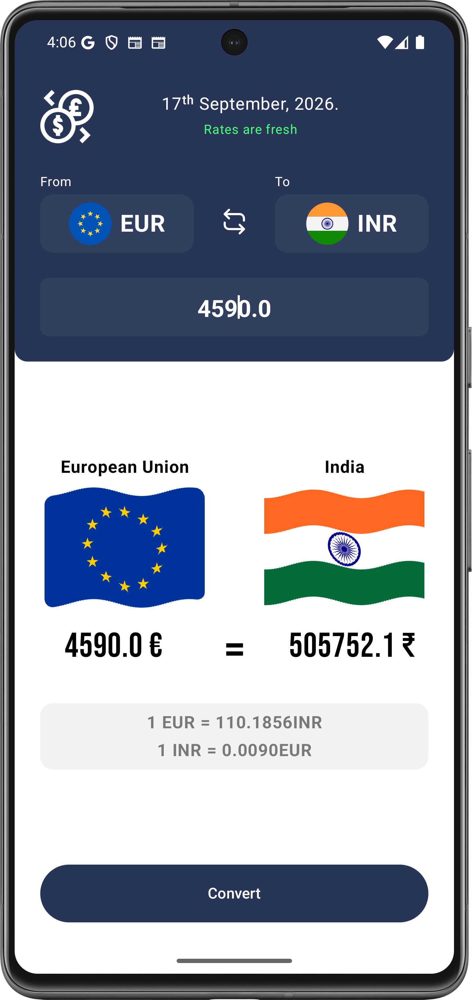
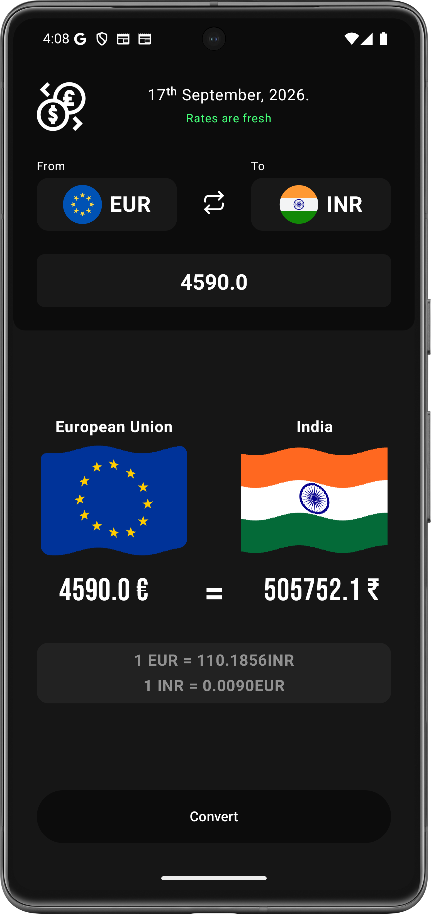
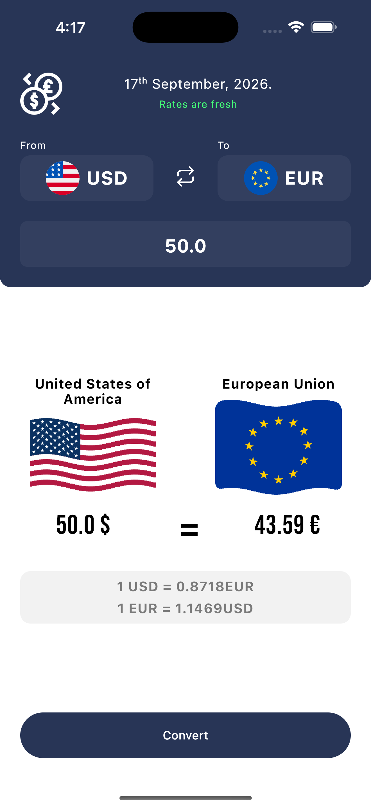
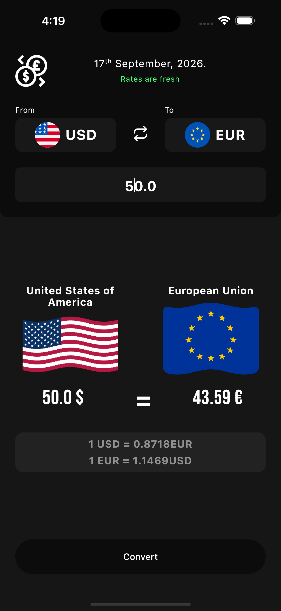

# 💱 CurrencyExchange — Kotlin Multiplatform App

A clean and efficient **Currency Exchange & Conversion** application built using **Compose
Multiplatform**, targeting both **Android** and **iOS** platforms. It provides real-time conversion
rates, automatic localized formatting, a smooth flag-waving layout, and persistent configuration
utilizing Koin Dependency Injection, SQLDelight, and Ktor.

---

## 📸 Screenshots & Overview

<table>
  <tr>
    <th align="center">Android — Light</th>
    <th width="24"></th>
    <th align="center">Android — Dark</th>
  </tr>
  <tr>
    <td align="center"></td>
    <td></td>
    <td align="center"></td>
  </tr>
  <tr><td colspan="3">&nbsp;</td></tr>
  <tr>
    <th align="center">iOS — Light</th>
    <th width="24"></th>
    <th align="center">iOS — Dark</th>
  </tr>
  <tr>
    <td align="center"></td>
    <td></td>
    <td align="center"></td>
  </tr>
</table>

<p align="center">
  <video src="https://github.com/user-attachments/assets/your-uploaded-video-id" controls width="300"></video>
</p>
<p align="center">
  <i>
    🎯 <b>Main Features Showcase:</b> Seamless light/dark mode compliance, dynamic edge-to-edge UI layouts drawing beautifully under the system status bars, flag-waving custom modifiers, and interactive instant-rate calculations.
  </i>
</p>
<p align="center">
  
</p>
<p align="center">
  <i>
    🎯 <b>Main Features Showcase:</b> Seamless light/dark mode compliance, dynamic edge-to-edge UI layouts drawing beautifully under the system status bars, flag-waving custom modifiers, and interactive instant-rate calculations.
  </i>
</p>

---

## 🛠 Built With

- **[Compose Multiplatform](https://www.jetbrains.com/lp/compose-multiplatform/)** — Shared UI
  framework for Android & iOS.
- **[Koin](https://insert-koin.io/)** — Lightweight dependency injection framework.
- **[SQLDelight](https://cashapp.github.io/sqldelight/)** — Cross-platform database library for
  offline storage and query generation.
- **[Voyager](https://voyager.adriel.cafe/)** — A pragmatic navigation library built specifically
  for Jetpack/Compose Multiplatform.
- **[Ktor](https://ktor.io/)** — Network library for making safe asynchronous REST api calls to
  retrieve exchange rates.

---

## 📂 Project Architecture

* **[/androidApp](./androidApp)** - Standard entry point module for the Android Application. Calls
  `enableEdgeToEdge()` to allow custom drawing under the system bars.
* **[/shared](./shared)** - Main multiplatform library containing completely shared business logic
  and Compose Multiplatform presentation views.
    - `commonMain`: Shared screens, ViewModels, repository interfaces, API integration, and database
      definitions.
    - `androidMain` / `iosMain`: Target-specific configurations (such as local platform
      initializers).

---

## 🚀 Running the App

### Android

Ensure an active emulator or device is connected, then execute:

```bash
./gradlew :androidApp:installDebug
```

### iOS

1. Ensure you are running on macOS with Xcode installed.
2. Open the `/iosApp` directory in Xcode:
3. Select your target device/simulator and click **Run (⌘ + R)**.

---

## 🧪 Running Tests

Execute target tests via Gradle tasks:

```bash
# Android Unit Tests
./gradlew :shared:testAndroidHostTest

# iOS Simulator Arm64 Tests
./gradlew :shared:iosSimulatorArm64Test
```
